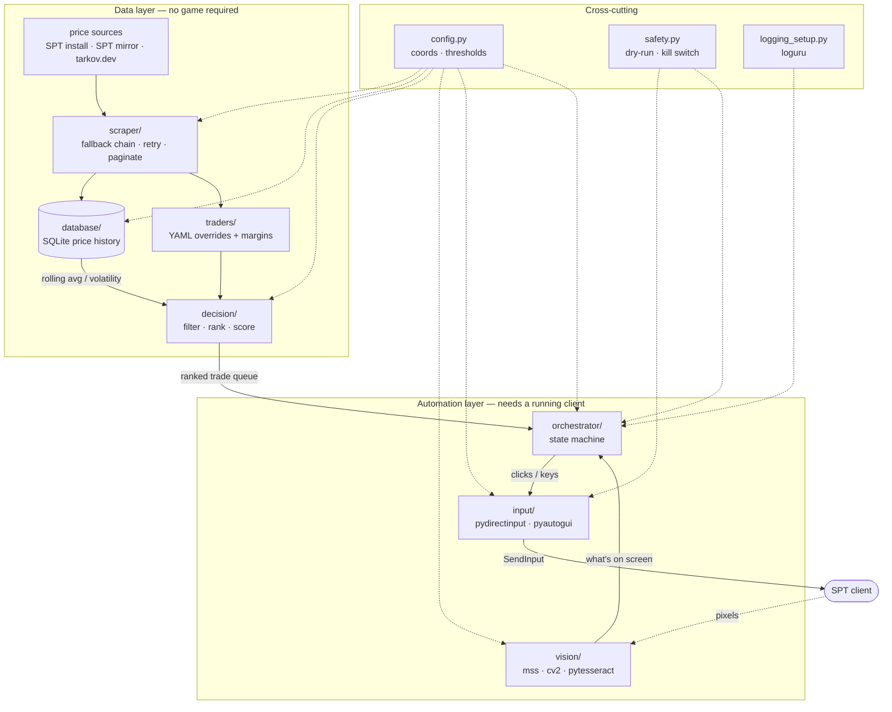

# flea-bot

Flea market price analysis and UI automation for **SPT** — the offline,
single-player Tarkov server emulator.

It fetches item prices, keeps a local price history, works out which flea
listings can be flipped to a trader at a profit, and (optionally) drives the
game UI through those trades using template matching, OCR and simulated input.

---

## ⚠️ Scope and disclaimer

**This is built for SPT (SPT-AKI) — an offline, self-hosted, single-player
server emulator. It is not intended for, and must not be used against, live
Escape from Tarkov servers or any other online game service.**

Specifics, so there is no ambiguity:

- SPT runs entirely on your own machine against your own server. There is no
  other player, no shared economy, and nothing to gain at anyone else's
  expense. Automating your own offline save affects only your own save.
- Using this — or anything like it — against **live EFT** would violate
  Battlestate Games' Terms of Service and Rules of Conduct, would manipulate an
  economy shared with real players, and would get the account permanently
  banned. Don't. That is not what this is for and the author does not support
  that use.
- Nothing here attempts to defeat, disable, or evade anti-cheat software. The
  randomised input delays exist because **Unity UIs drop perfectly-timed
  input** and because deterministic clicking hides coordinate bugs — see
  [`input/controller.py`](src/flea_bot/input/controller.py). They are not an
  evasion mechanism, and they would not function as one.
- By default, price data comes from **your own SPT server's database** — the
  same table your game prices the flea market from. See
  [Price sources](#price-sources).

If you fork this, keep it offline. Seriously.

---

## Price sources

Set `[prices].source` in your config. `auto` (the default) tries these in order
and falls through on failure, so a dead upstream never stops the tool working.

| Source | Accuracy for SPT | Needs | Notes |
|---|---|---|---|
| `spt` | **Exact** | Local SPT install | Reads your server's own `prices.json`. This *is* your game's price table. |
| `spt-mirror` | Prices exact, trader payouts are an **upper bound** | Nothing | Same files from the [SPT repo](https://github.com/sp-tarkov/server). Use when you're not on the SPT machine. |
| `tarkov.dev` | Different economy | Nothing | Live Tarkov community data. Cross-reference only. |

### How trader payouts are computed

From SPT's own `TraderHelper.ts`:

```
// buy_price_coef is the inverse percentage,
// must subtract from 100 to get proper buyback percent
const pct = 100 - traderBase.loyaltyLevels[0].buy_price_coef;
```

So `trader_pays = handbook_price × (100 − buy_price_coef) / 100`. Therapist's
coefficient of `37` means she pays **63%** of handbook, not 37%. Current
coefficients, read from the SPT repo:

| Trader | `buy_price_coef` | Pays |
|---|---|---|
| Therapist | 37 | 63% |
| Ragman | 38 | 62% |
| Jaeger | 40 | 60% |
| Mechanic | 44 | 56% |
| Skier | 51 | 49% |
| Prapor | 50 | 50% |
| Peacekeeper | 55 | 45% (USD) |

### The one thing the mirror can't do

Which traders will buy an item is defined by `items_buy.category` in each
trader's `base.json`, and resolving those categories requires
`templates/items.json` — an 18 MB Git-LFS file GitHub's raw endpoints don't
serve.

- **Local install** → eligibility resolved exactly.
- **Mirror** → best payout across *all* traders, which may name a trader who
  would refuse the item. The bot warns loudly when running this way. Pin
  anything you actually trade in
  [`config/trader_prices.yaml`](config/trader_prices.yaml), which always wins.

Snapshots are tagged with their source, and the rolling-average/volatility
queries filter on it — SPT and live prices describe different economies and
averaging them produces a number that describes neither.

---

## Architecture



The split matters: **everything above the dashed line runs without a game
open.** You can fetch, rank, and analyse prices on any machine — that half is
plain data work. Only the orchestrator needs a live client.

### Module map

| Module | Responsibility |
|---|---|
| [`config.py`](src/flea_bot/config.py) | Typed config; every coordinate and threshold lives here |
| [`scraper/`](src/flea_bot/scraper/) | Price sources (SPT data, tarkov.dev) behind one protocol, with a fallback chain |
| [`database/`](src/flea_bot/database/) | SQLAlchemy schema; snapshot inserts; rolling average + volatility |
| [`traders/`](src/flea_bot/traders/) | Trader price reference (YAML) and `profit_margin` |
| [`decision/`](src/flea_bot/decision/) | Threshold filtering and top-N ranking, with an audit trail |
| [`vision/`](src/flea_bot/vision/) | `mss` capture, `cv2` template matching, `pytesseract` OCR |
| [`input/`](src/flea_bot/input/) | Click/drag/type wrappers with humanised timing |
| [`orchestrator/`](src/flea_bot/orchestrator/) | The `transitions` state machine that ties it together |
| [`safety.py`](src/flea_bot/safety.py) | Dry-run, pause/kill hotkeys, runaway guards, spend cap |
| [`ledger.py`](src/flea_bot/ledger.py) | Thread-safe session ledger: spent / earned / net / budget remaining |
| [`setup_wizard.py`](src/flea_bot/setup_wizard.py) | Interactive calibration that writes `config.toml` |
| [`gui/`](src/flea_bot/gui/) | Tkinter dashboard; worker thread + event queue bridge |

---

## Setup

### 1. Install uv

```bash
curl -LsSf https://astral.sh/uv/install.sh | sh
```

On Windows (PowerShell):

```powershell
powershell -ExecutionPolicy ByPass -c "irm https://astral.sh/uv/install.ps1 | iex"
```

### 2. Install the project

```bash
cd flea-bot && uv sync --extra dev
```

`uv` will fetch a suitable Python automatically if the system one is too old.

### 3. Install Tesseract (only needed for OCR)

| Platform | Command |
|---|---|
| Debian/Ubuntu | `sudo apt install tesseract-ocr` |
| Fedora | `sudo dnf install tesseract` |
| macOS | `brew install tesseract` |
| Windows | [UB-Mannheim installer](https://github.com/UB-Mannheim/tesseract/wiki), then set `[ocr].tesseract_cmd` |

### 4. Calibrate

```bash
uv run flea-bot setup
```

The wizard walks you through pointing at each UI element — you mark two corners
per item and it reads your cursor, so you never type a coordinate. It captures
the template images and writes `config/config.toml` for you.

Re-run it after any resolution or UI-scale change. It replaces only the
`[window]` sections and backs up your old config first, so tuned thresholds
survive. To redo a single item:

```bash
uv run flea-bot setup --only sell_button
```

### 5. Check the install

```bash
uv run flea-bot doctor
```

This reports missing dependencies, an unusable Tesseract, uncaptured template
images, and which price source you'll get. Get it green before going anywhere
near live mode.

---

## Configuration

Everything lives in `config/config.toml` (gitignored — it holds machine-specific
coordinates). The example file documents every key inline.

The parts you must set yourself:

**`[window]`** — the game window's position and size, plus named regions in
absolute screen pixels. Find coordinates by hovering and reading them off:

```bash
uv run flea-bot calibrate
```

**`[window.templates]`** — reference images of UI elements. These *cannot* ship
with the repo; they depend on your resolution, UI scale, and any mods. Capture
them from your own client:

```bash
uv run flea-bot snip --name flea_market_tab --region 100,60,180,40
```

**`[thresholds]`** — what counts as worth doing. Start conservative:

| Key | Meaning |
|---|---|
| `min_margin` | Absolute roubles of profit required |
| `min_margin_ratio` | Profit as a fraction of cost (`0.15` = 15% return) |
| `min_flea_price` / `max_flea_price` | Price band to consider |
| `max_volatility` | Reject items whose price swings more than this (stddev/mean) |
| `top_n` | How many candidates to return |

**`config/trader_prices.yaml`** — trader sell prices for *your* SPT server,
which override whatever the API reports. Also holds a blacklist.

---

## The dashboard

```bash
uv run flea-bot gui
```

Live net profit, spend, earnings and remaining budget; a progress bar for the
session cap; start/pause/stop; and an activity log.

Two deliberate choices in there:

- **Dry run is ticked on every launch**, regardless of what's in your config.
  Leaving it requires a confirmation dialog. The safe option shouldn't be
  something you can end up in live mode by forgetting.
- **The spend cap is enforced in `safety.py`, not in the window.** It holds for
  headless runs, scheduled runs, and runs where the GUI has crashed. A budget
  that only exists in a window is not a budget.

Starting a live run with the budget set to `0` (unlimited) prompts an extra
confirmation, because that combination can spend every rouble you have.

## Usage

All commands default to **dry-run**. Nothing touches the game until you pass
`--live`.

```bash
# Fetch current prices into the local database
uv run flea-bot fetch

# Show the most profitable flips (fetches, ranks, prints — never clicks)
uv run flea-bot rank --top 20 --show-rejects

# Rolling average and volatility for an item, from your own history
uv run flea-bot stats "Bottle of water"

# Drive the state machine, logging every intended action without executing it
uv run flea-bot run --dry-run

# Actually do it (prompts for confirmation first)
uv run flea-bot run --live --max-trades 5
```

### Building useful history

Volatility filtering needs at least three samples per item. Run `fetch` on a
schedule for a day or two before trusting `max_volatility`:

```bash
# crontab -e  — hourly snapshot
0 * * * * cd /path/to/flea-bot && uv run flea-bot fetch >> /tmp/flea-bot.log 2>&1
```

---

## Safety

This drives a mouse. Treat it accordingly.

| Mechanism | What it does |
|---|---|
| **Dry-run** (default) | Logs every action as `[DRY] would …`; the input backend is swapped for a no-op sink, so there is no code path that dispatches input |
| **Session spend cap** | Hard limit on roubles spent per run, checked *before* each purchase. Reserve/commit/release, so an aborted trade returns its budget and a drifted price consumes the real amount |
| **Kill switch** (`F10`) | Stops at the next checkpoint, even mid-pause |
| **Pause** (`F9`) | Blocks before the next action; press again to resume |
| **Action cap** | Hard stop after `safety.max_actions_per_run` actions |
| **Failure breaker** | Stops after `safety.max_consecutive_failures` vision failures, rather than clicking blind |
| **State verification** | Every FSM transition re-checks the screen for the template defining that state |
| **Price drift guard** | Refuses a trade if the on-screen price is >10% above the price the ranking engine approved |

Hotkeys need the `keyboard` library, which **requires root on Linux** to read
`/dev/input`. Without it the bot still runs but warns loudly that you have no
panic button. On Linux, `Ctrl-C` in the terminal is your fallback.

**Recommended first run:** `dry-run`, watching the log, with the game open on
the flea market screen. Confirm the coordinates and template matches are landing
where you expect before you ever pass `--live`.

---

## Platform notes

The input layer picks a backend at runtime:

| Platform | Backend | Works? |
|---|---|---|
| Windows | `pydirectinput` | Yes — writes scancodes via `SendInput`, which DirectInput titles read |
| Linux/macOS | `pyautogui` | Partially — XTEST-synthesised events are ignored by many games |

Data-layer commands (`fetch`, `rank`, `stats`) work anywhere. If you develop on
Linux but run SPT on Windows (or under Proton), expect to do the vision/input
half on the Windows side.

---

## Development

```bash
uv run pytest              # full suite; no network, no screen, no game
uv run pytest --cov=flea_bot
uv run ruff check .
uv run mypy
```

The test suite fakes vision and input (`FakeMatcher`, `FakeReader`,
`NullBackend`), so transition logic, the price-drift guard, and the safety
interlocks are all testable without launching Tarkov.

---

## License

MIT. Provided as-is, for offline single-player use.
